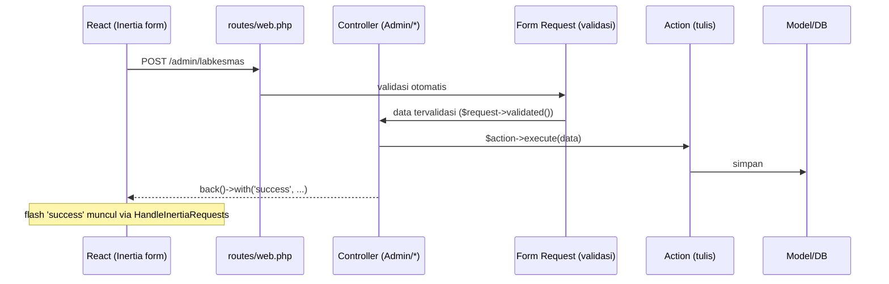
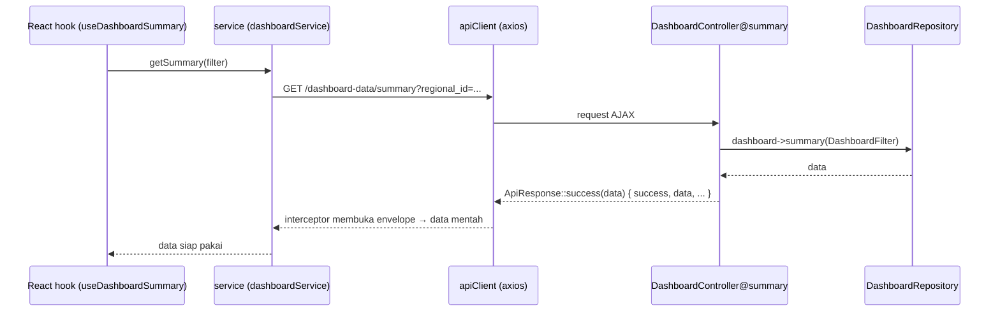

# Dokumentasi Alur Website — InPULS KEMENKES (Dashboard Labkesmas)

Panduan arsitektur & alur aplikasi, ditulis agar mudah **menyesuaikan tampilan, kata, atau menambah fitur** di kemudian hari. Baca bagian [Panduan Kustomisasi](#7-panduan-kustomisasi) kalau kamu hanya ingin cepat mengubah sesuatu.

## Daftar Isi
1. [Ringkasan & Teknologi](#1-ringkasan--teknologi)
2. [Peta Folder (di mana letak apa)](#2-peta-folder-di-mana-letak-apa)
3. [Model Data (domain)](#3-model-data-domain)
4. [Alur Deploy (web hosting)](#4-alur-deploy-web-hosting)
5. [Arsitektur Backend (Laravel)](#5-arsitektur-backend-laravel)
6. [Arsitektur Frontend (React + Inertia)](#6-arsitektur-frontend-react--inertia)
7. [Panduan Kustomisasi](#7-panduan-kustomisasi)
8. [Konvensi & Aturan Main](#8-konvensi--aturan-main)
9. [Perintah Umum](#9-perintah-umum)

---

## 1. Ringkasan & Teknologi

Aplikasi dashboard pemantauan **Labkesmas** (Laboratorium Kesehatan Masyarakat) berjenjang: menampilkan ringkasan & tren pemeriksaan per wilayah, plus panel admin untuk mengelola master data dan input data bulanan.

| Lapisan | Teknologi |
|---|---|
| Backend | Laravel (PHP 8.2+), Fortify (auth) |
| Jembatan | **Inertia.js** — menghubungkan Laravel & React tanpa REST API terpisah |
| Frontend | React 19 + **TypeScript**, Vite, Tailwind CSS v4 |
| Komponen UI | Pola shadcn/ui (`Components/ui`) + Radix + lucide-react |
| Grafik | Recharts · Animasi: framer-motion |
| Database | MySQL (produksi) / SQLite (lokal) |

**Dua "gaya" komunikasi data** (penting untuk dipahami):
- **Inertia** — untuk pindah halaman & seluruh CRUD admin. Controller mengembalikan `Inertia::render()` atau `back()`, React menerimanya sebagai props. Tidak ada `fetch` manual.
- **JSON/axios** — hanya untuk data dashboard yang di-*refresh* saat filter berubah (`/dashboard-data/*`). Dibungkus envelope `ApiResponse`.

---

## 2. Peta Folder (di mana letak apa)

### Backend — `app/`
```
app/
├─ Http/
│  ├─ Controllers/           Thin controllers (tanpa logika query)
│  │  ├─ Admin/              Panel admin (butuh login) — CRUD via Inertia
│  │  └─ (root)              Controller publik: Landing, Dashboard, StandarLabkesmas, Wilayah
│  ├─ Requests/              Validasi input (Form Request) per aksi Store/Update
│  ├─ Resources/             Transformer bentuk JSON (API Resource)
│  └─ Middleware/
│     └─ HandleInertiaRequests.php   Data yang dibagi ke SEMUA halaman (auth, flash)
├─ Actions/                  Operasi TULIS (create/update/delete) — 1 aksi = 1 class
├─ Repositories/
│  ├─ Contracts/             Interface repository (kontrak)
│  └─ Eloquent/              Implementasi query baca
├─ Models/                   Model Eloquent (tabel database)
├─ Providers/                RepositoryServiceProvider (binding), FortifyServiceProvider (auth)
└─ Support/
   ├─ ApiResponse.php        Envelope JSON { success, message, data, errors }
   └─ DashboardFilter.php    Objek filter dashboard dari query request
```

### Frontend — `resources/js/`
```
resources/js/
├─ app.tsx                   Entry: inisialisasi Inertia + React
├─ bootstrap.ts              Konfigurasi axios global
├─ Pages/                    1 file = 1 halaman Inertia (dipetakan dari Inertia::render)
│  ├─ Landing/ Dashboard/ StandarLabkesmas/   Publik
│  ├─ Auth/Login.tsx                          Halaman login
│  └─ Admin/                                  Halaman panel admin
├─ Layouts/                  Kerangka halaman: PublicLayout, AdminLayout, GuestLayout
├─ Components/               Atomic design:
│  ├─ atoms/                 Elemen terkecil (Spinner, Skeleton, Emblem)
│  ├─ molecules/             Gabungan atom (StatCard, FilterDropdown, ...)
│  ├─ organisms/             Bagian kompleks (DataTable, TrendChart, ...Manager)
│  └─ ui/                    Primitif gaya shadcn (button, card, input, select...)
├─ hooks/                    Logika reusable (useAsyncData, useDashboardSummary, ...)
├─ services/api/             Pemanggilan endpoint JSON (client + service per domain)
├─ context/                  DashboardFilterContext (state filter global dashboard)
├─ types/                    Definisi TypeScript per domain
└─ lib/
   ├─ constants.ts           SUMBER TUNGGAL: nama app, label Tier, nama bulan, daftar endpoint
   └─ utils.ts               Helper (cn() untuk gabung className)
```

### Titik penting lain
- `routes/web.php` — semua rute (publik, JSON, admin).
- `resources/views/app.blade.php` — satu-satunya template HTML (root Inertia).
- `resources/css/app.css` — konfigurasi Tailwind & token warna/tema.
- `.htaccess` (root) — pengarah ke folder `public/` untuk hosting tanpa akses ubah document root.

---

## 3. Model Data (domain)

Hierarki wilayah berjenjang, lab menempel di kabupaten/kota, data pemeriksaan dicatat per bulan.

```
Negara → Regional → Provinsi → KabupatenKota → Labkesmas ──┐
                                                            ├─ DataPemeriksaan (per bulan & tahun)
                                       JenisPemeriksaan ────┘
```

- **Labkesmas** punya `tier_labkesmas` (2–5). Arti tier ada di `lib/constants.ts` → `TIER_OPTIONS`:
  - Tier 5 = Nasional · Tier 4 = Regional · Tier 3 = Provinsi · Tier 2 = Kabupaten/Kota
- **DataPemeriksaan** = jumlah pemeriksaan satu Labkesmas untuk satu JenisPemeriksaan pada `bulan`+`tahun` tertentu (di-*upsert*: input ulang periode sama akan memperbarui).
- **User** — akun admin (`role: super_admin`) untuk mengakses `/admin`.

---

## 4. Alur Deploy (web hosting)

Hosting meletakkan **seluruh repo ke dalam `public_html`** dan document root tidak bisa dipindah. Solusinya sudah tertanam di repo:

- **`.htaccess`** (root) mengarahkan semua request ke subfolder `public/` (front controller Laravel). Tidak perlu memindah file.
- **`vendor/`** dan **`public/build/`** sengaja di-commit (lihat `.gitignore`) supaya `git pull` di server langsung jalan — **tanpa** `composer install` / `npm run build` di server.

Alur sekali jalan:
1. `git push` ke GitHub (setelah `npm run build` bila ada perubahan frontend — lihat [§9](#9-perintah-umum)).
2. Deploy/pull via GitHub di hPanel → semua file masuk `public_html`.
3. `.env` dibuat sekali di server (untracked, bertahan saat re-deploy).
4. `.htaccess` mengarahkan trafik → app jalan.

> Detail langkah manual hPanel ada di `DEPLOY-HOSTINGER-NOCLI.md` (file lokal, tidak di-commit karena memuat kredensial).

---

## 5. Arsitektur Backend (Laravel)

**Prinsip: controller "tipis".** Controller hanya menerima request, mendelegasikan, lalu mengembalikan response. Logika baca ada di **Repository**, logika tulis ada di **Action**, validasi ada di **Form Request**.

### Siklus request — CRUD admin (Inertia)

Contoh nyata: `Admin/LabkesmasController@store` → `StoreLabkesmasRequest` → `RegisterLabkesmasAction`.

### Siklus request — data dashboard (JSON)


### Peran tiap lapisan
| Lapisan | Tugas | Contoh file |
|---|---|---|
| **Controller** | Terima request, delegasi, kembalikan response | `Http/Controllers/**` |
| **Form Request** | Validasi + otorisasi input | `Http/Requests/**` |
| **Action** | Satu operasi tulis (create/update/delete) | `Actions/**` |
| **Repository** | Query baca (Eloquent) di balik interface | `Repositories/**` |
| **Resource** | Bentuk output JSON yang konsisten | `Http/Resources/**` |
| **Model** | Representasi tabel + relasi | `Models/**` |
| **Support** | `ApiResponse` (envelope), `DashboardFilter` (DTO filter) | `Support/**` |

> Binding interface → implementasi ada di `Providers/RepositoryServiceProvider.php`. Untuk mengganti sumber data cukup ubah di sini.

---

## 6. Arsitektur Frontend (React + Inertia)

### Bagaimana halaman dirender
1. `resources/views/app.blade.php` memuat `app.tsx` lewat `@vite`.
2. `app.tsx` menjalankan `createInertiaApp` yang memetakan nama halaman → file di `Pages/`.
   - `Inertia::render('Admin/Labkesmas/Index')` (backend) ⇒ `Pages/Admin/Labkesmas/Index.tsx` (frontend).
3. Props dari controller diterima langsung sebagai props komponen halaman.

Contoh (`Pages/Admin/Labkesmas/Index.tsx`): menerima `items` dari controller, membungkus dengan `AdminLayout`, lalu merender organism `LabkesmasManager`.

### Hierarki komponen (atomic design)
```
Page  →  Layout  →  Organism  →  Molecule  →  Atom / ui
(halaman)  (kerangka)  (bagian besar)  (gabungan)  (elemen dasar)
```
Aturan: halaman merakit, organism berisi logika UI kompleks, molecule/atom sedapat mungkin "bodoh" (hanya menerima props).

### Alur data & shared props
- **Shared props** (tersedia di semua halaman) diset di `HandleInertiaRequests@share`: `auth.user` dan `flash.success/error`. Dibaca via `usePage<SharedPageProps>()`.
- **Data dashboard** memakai `hooks/` → `services/api/` → `apiClient`. `apiClient` (di `services/api/client.ts`) punya interceptor yang otomatis membuka envelope `ApiResponse` dan melempar error yang ramah.
- **State filter dashboard** disimpan di `context/DashboardFilterContext.tsx`; perubahan filter memicu hook mengambil ulang data.

---

## 7. Panduan Kustomisasi

Bagian paling praktis. Cari skenariomu.

### A. Mengubah kata / teks / label
| Ingin ubah | Edit di |
|---|---|
| Nama aplikasi (judul, header) | `resources/js/lib/constants.ts` → `APP_NAME`; & `.env` → `APP_NAME` (judul tab browser via `config('app.name')`) |
| Label/arti **Tier** | `lib/constants.ts` → `TIER_OPTIONS` (satu tempat, jangan hardcode di komponen) |
| Menu navigasi admin | `Layouts/AdminLayout.tsx` → `NAV_ITEMS` |
| Nama bulan | `lib/constants.ts` → `MONTH_NAMES` |
| Teks tombol/judul halaman | file `Pages/**` atau `Components/**` terkait |
| Pesan sukses/gagal admin | di Controller terkait, pada `->with('success', '...')` |

### B. Mengubah tampilan / warna / gaya
- **Warna & tema (global):** `resources/css/app.css` — di situ token warna Tailwind v4 (mis. `--color-*`, `foreground`, `muted`, `destructive`) didefinisikan. Ubah di sini agar konsisten light/dark.
- **Gaya per komponen:** ubah class Tailwind langsung di file komponen. Gabungkan class dengan helper `cn()` dari `lib/utils.ts`.
- **Primitif UI (tombol, kartu, input):** `Components/ui/*` — mis. varian tombol ada di `ui/button.tsx` (memakai `class-variance-authority`).
- Setelah mengubah frontend, **wajib** `npm run build` sebelum deploy (lihat §9).

### C. Menambah fitur baru — CRUD master baru (pola lengkap)
Ikuti pola "Labkesmas" yang sudah ada. Misal menambah master **"Alat"**:

**Backend**
1. Migration + `Models/Alat.php`.
2. `Http/Requests/Alat/StoreAlatRequest.php` (+ Update) untuk validasi.
3. `Actions/Alat/SaveAlatAction.php`, `DeleteAlatAction.php` (operasi tulis).
4. (Baca) tambah method di repository terkait, atau buat `AlatRepository` + kontraknya, lalu daftarkan di `RepositoryServiceProvider`.
5. `Http/Controllers/Admin/AlatController.php` — tipis: `index` (render Inertia + data), `store/update/destroy` (delegasi ke Action).
6. Daftarkan rute di `routes/web.php` dalam grup `admin` (ikuti blok Labkesmas).

**Frontend**
7. `types/alat.ts` — tipe data.
8. `Pages/Admin/Alat/Index.tsx` — bungkus `AdminLayout`, render organism.
9. `Components/organisms/AlatManager.tsx` — tabel + form (pakai `DataTable`, `ConfirmButton`, `ui/*` yang ada). Kirim data via Inertia `router.post/put/delete` (bukan axios).
10. Tambah item menu di `AdminLayout.tsx` → `NAV_ITEMS`.

> Nama string di `Inertia::render('Admin/Alat/Index')` **harus persis** sama dengan path `Pages/Admin/Alat/Index.tsx`.

### D. Menambah metrik / grafik baru di dashboard
1. **Backend:** tambah method di `DashboardRepository` (+ kontrak), lalu endpoint di `DashboardController` yang mengembalikan `ApiResponse::success(...)`, dan rute di grup `dashboard-data`.
2. **Konstanta:** tambah URL-nya di `lib/constants.ts` → `DASHBOARD_ENDPOINTS`.
3. **Service:** tambah fungsi di `services/api/dashboardService.ts`.
4. **Hook:** buat hook (tiru `useDashboardSummary.ts`) memakai `useAsyncData`.
5. **UI:** konsumsi hook di komponen (mis. organism grafik baru), tangani state loading/empty/error dengan `Skeleton`/`EmptyState`/`ErrorState`.

---

## 8. Konvensi & Aturan Main

Pegang ini agar kode tetap konsisten & mudah dirawat:

- **Sumber tunggal (single source of truth).** Label Tier, nama app, nama bulan, daftar endpoint → hanya di `lib/constants.ts`. Menu admin → hanya di `AdminLayout.tsx`. Jangan hardcode ganda.
- **Controller tipis.** Tidak ada query/logika bisnis di controller. Baca → Repository, tulis → Action, validasi → Form Request.
- **Dua gaya response tidak dicampur.** Admin/halaman = Inertia (`render`/`back`). Data dashboard = JSON `ApiResponse`. (Lihat catatan di `Support/ApiResponse.php` — membungkus response Inertia akan merusak error-handling React.)
- **Penamaan halaman = path.** String `Inertia::render('X/Y')` sama persis dengan `Pages/X/Y.tsx`.
- **Atomic design.** Elemen kecil di `atoms/ui`, rakitan di `molecules/organisms`, perakitan akhir di `Pages`.
- **TypeScript dulu.** Tambah/ubah tipe di `types/` saat mengubah bentuk data.
- **Case-sensitive di server.** Nama file/impor harus tepat huruf besar-kecil (Linux hosting berbeda dari Windows).

---

## 9. Perintah Umum

```bash
# Pengembangan lokal (jalankan dua terminal, atau gunakan concurrently)
php artisan serve        # backend di http://localhost:8000
npm run dev              # Vite dev server (hot reload)

# Build aset produksi (WAJIB sebelum commit/deploy bila frontend berubah)
npm run build            # menghasilkan public/build/ (manifest + assets)

# Setelah build, sertakan hasilnya ke commit:
git add public/build && git commit -m "build: ..." && git push

# Database (lokal)
php artisan migrate --seed   # buat tabel + akun admin + data contoh
```

**Ritme deploy singkat:** ubah kode → (`npm run build` bila frontend berubah) → `git commit` (termasuk `public/build`) → `git push` → pull/deploy di hPanel.

---

> Catatan keamanan: jangan pernah menaruh `APP_KEY`, password, atau kredensial DB di file yang di-commit. File yang memuat rahasia (`.env*`, `database-schema.sql`, `DEPLOY-HOSTINGER-NOCLI.md`) sudah masuk `.gitignore`.
