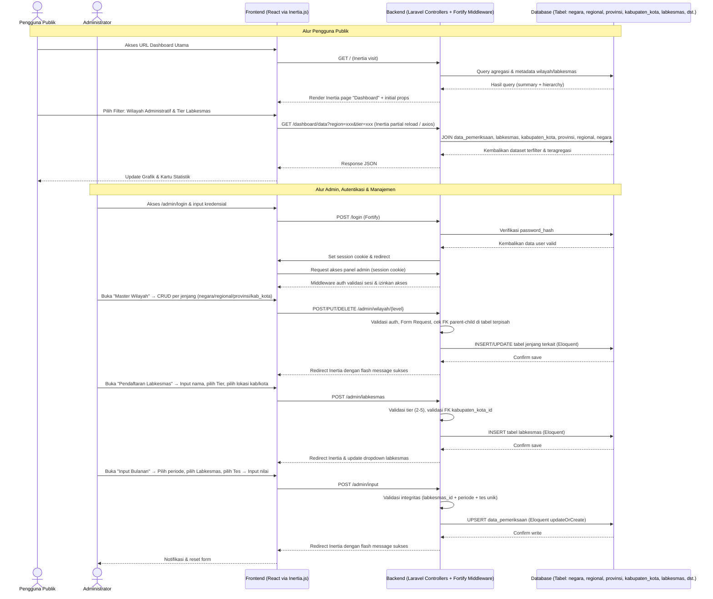
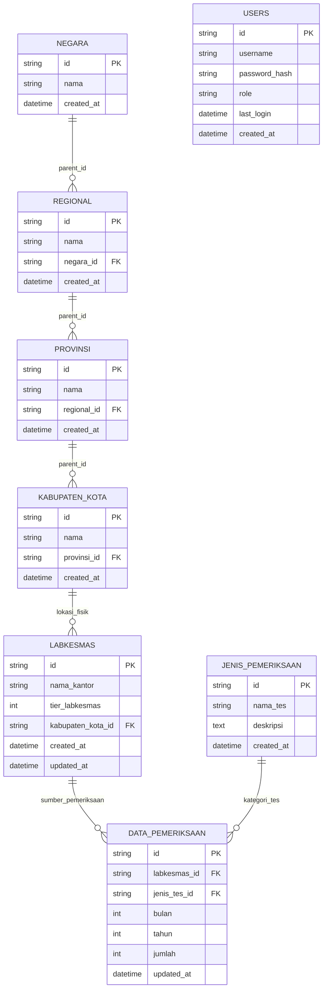

# PRD — Project Requirements Document

## 1. Overview
Aplikasi ini adalah dashboard web interaktif yang dirancang untuk memantau, menganalisis, dan membandingkan data pemeriksaan Laboratorium Kesehatan Masyarakat (Labkesmas) secara terstruktur. Sistem ini memisahkan secara eksplisit antara dua entitas utama: **Wilayah Administratif** dan **Entitas Labkesmas**.

Struktur Wilayah Administratif kini dipecah menjadi empat tabel terpisah per jenjang hierarki untuk meningkatkan integritas data dan kemudahan manajemen: `negara`, `regional`, `provinsi`, dan `kabupaten_kota`. Struktur ini berfungsi sebagai peta lokasi administrasi yang saling berelasi parent-child.

Entitas Labkesmas bersifat independen dan dinamis. Setiap Labkesmas direpresentasikan sebagai kantor/fasilitas yang memiliki klasifikasi Tier (5, 4, 3, atau 2) dan berlokasi (beralamat) di satu wilayah administratif tingkat Kabupaten/Kota tertentu. Tier 5 mewakili labkesmas tingkat nasional, Tier 4 tingkat regional, Tier 3 tingkat provinsi, dan Tier 2 tingkat kabupaten/kota. Satu kabupaten/kota dapat menampung banyak labkesmas, dan labkesmas dengan tier berbeda dapat berada di wilayah administratif yang sama.

Tujuan utama aplikasi adalah memberikan kemudahan bagi pemangku kepentingan untuk melihat tren pemeriksaan bulanan berdasarkan lokasi administratif atau berdasarkan tier labkesmas secara independen. Sistem mendukung filter bersarang untuk wilayah, filter spesifik untuk tier lab, serta fitur komparasi lintas entitas. Di sisi operasional, panel admin memungkinkan pengelolaan metadata wilayah per jenjang, pendaftaran labkesmas baru (dengan penentuan tier dan alamat lokasi presisi), serta penginputan data pemeriksaan bulanan yang terikat pada entitas labkesmas tertentu.

## 2. Requirements
- **Aksesibilitas & Performa:** Website responsif, memuat data dengan cepat (loading < 2 detik), dan dapat diakses via browser desktop/mobile tanpa instalasi tambahan.
- **Pemisahan Entitas Wilayah & Labkesmas:** Sistem menggunakan tabel terpisah untuk setiap jenjang wilayah (`negara`, `regional`, `provinsi`, `kabupaten_kota`) yang saling terhubung via FK. Entitas labkesmas berdiri sendiri dengan atribut Tier dan FK ke `kabupaten_kota_id` untuk lokasi fisik.
- **Klasifikasi Tier Labkesmas:** 
  - Tier 5: Labkesmas perwakilan tingkat nasional.
  - Tier 4: Labkesmas perwakilan tingkat regional.
  - Tier 3: Labkesmas perwakilan tingkat provinsi.
  - Tier 2: Labkesmas perwakilan tingkat kabupaten/kota.
  - Tier labkesmas bersifat atribut tetap pada entitas labkesmas dan tidak berubah secara otomatis berdasarkan hierarki wilayah.
- **Filter Independen:** Sistem mendukung filter berbasis Wilayah Administratif (kaskade parent-child antar tabel) DAN filter berbasis Tier Labkesmas (2-5) secara terpisah maupun gabungan. Data otomatis teragregasi sesuai cakupan yang dipilih.
- **Visualisasi Data:** Menyediakan grafik distribusi jenis pemeriksaan dan tren bulanan yang interaktif, responsif, dan mendukung grouping berdasarkan wilayah administratif, tier, atau entitas labkesmas individu.
- **Kemampuan Komparasi:** UI menyediakan mekanisme pemilihan dua parameter (wilayah, tier, atau labkesmas spesifik) untuk ditampilkan berdampingan dengan skala seragam.
- **Pembaruan Data Mandiri:** Admin dapat menambah/mengedit wilayah administratif per jenjang, mendaftarkan labkesmas baru (dengan penentuan tier dan lokasi kab/kota), mengatur jenis pemeriksaan, dan memperbarui angka pemeriksaan bulanan tanpa campur tangan developer atau downtime.
- **Keamanan & Akses Terkontrol:** Panel admin dilindungi autentikasi aman berbasis sesi (Laravel Fortify). Proteksi rute ketat via middleware `auth`, validasi input ketat via Form Request, dan pelacakan audit dasar untuk integritas data.

## 3. Core Features
- **Dashboard First Win Ringkas:** Kartu ringkasan utama menampilkan total pemeriksaan nasional/tier/wilayah terkini secara instan. Angka dinamis menyesuaikan filter aktif.
- **Grafik Tren Bulanan Interaktif:** Diagram batang/garis dengan tooltip detail, mendukung pengelompokan (grouping) oleh jenis tes, wilayah administratif, tier labkesmas, atau nama labkesmas spesifik.
- **Filter Wilayah Berjenjang & Filter Tier Independen:** 
  - Dropdown kaskade untuk Wilayah Administratif yang membaca dari tabel terpisah (`negara` → `regional` → `provinsi` → `kabupaten_kota`).
  - Selector terpisah untuk Tier Labkesmas (5, 4, 3, 2).
  - Kedua filter dapat digunakan bersama atau tunggal untuk analisis multidimensi.
- **Fitur Komparasi Dual-Parameter:** Pengguna memilih dua entitas (misal: Tier 4 Sumatera vs Tier 4 Sulawesi, atau Labkesmas A vs Labkesmas B) untuk melihat perbandingan tren, volume, dan komposisi tes dalam satu tampilan split/kombinasi.
- **Autentikasi Admin Aman:** Login terenkripsi via Laravel Fortify, manajemen sesi berbasis session Laravel, proteksi rute `/admin/*` via middleware, password hashing modern (bcrypt/argon2id), dan lockout setelah percobaan gagal berulang (built-in rate limiter Fortify).
- **Panel Input & Kelola Data Lengkap:**
  - **Master Wilayah Terpisah:** CRUD independen untuk entitas Negara, Regional, Provinsi, dan Kab/Kota dengan validasi relasi parent-child di masing-masing tabel.
  - **Master & Pendaftaran Labkesmas:** Admin mendaftarkan labkesmas baru dengan nama kantor, memilih Tier (2-5), dan menentukan lokasi fisik dengan memilih wilayah administratif tingkat Kabupaten/Kota dari dropdown kaskade yang mengacu pada tabel terpisah. Sistem menyimpan hubungan 1:n antara kabupaten/kota dan labkesmas.
  - **Input Data Transaksional (Berbasis Labkesmas):** Form penginputan data bulanan. Admin memilih Tahun, Bulan, entitas Labkesmas (dari daftar yang sudah terdaftar), Jenis Tes, lalu input nilai. Sistem validasi duplikasi (labkesmas_id + tes + periode) dan integritas data sebelum penyimpanan. Data langsung terindeks ke dashboard publik.

## 4. User Flow
1. **Membuka Dashboard:** Pengguna mengakses URL utama dan disambut halaman publik dengan ringkasan total pemeriksaan terkini.
2. **Melihat Ringkasan Awal:** Angka utama menampilkan total agregat sesuai filter default (biasanya Nasional/Tier 5 atau terakhir diakses).
3. **Eksplorasi Filter Terpisah:** 
   - Pengguna membuka filter Wilayah Administratif, memilih `regional` → `provinsi` → `kabupaten_kota` → grafik diperbarui menampilkan agregasi semua labkesmas yang berlokasi di kabupaten/kota tersebut.
   - Pengguna juga dapat memilih filter Tier Labkesmas secara independen (misal: hanya Tier 3), menampilkan agregasi seluruh labkesmas provinsi di seluruh wilayah.
4. **Melakukan Komparasi:** Pengguna mengklik "Bandingkan", memilih dua entitas (misal: Labkesmas Y vs Labkesmas Z, atau Tier 4 vs Tier 3). Visualisasi menampilkan data paralel.
5. **Analisis & Drill-down:** Pengguna mengganti level filter wilayah atau tier. Data otomatis teragregasi atau terfilter ulang sesuai entitas labkesmas yang memenuhi kriteria.
6. **Admin Login & Kelola Data:**
   - Admin akses `/admin/login`, verifikasi kredensial, masuk ke Dashboard Administrasi.
   - **Kelola Wilayah Terpisah:** Admin membuka menu terpisah untuk `Data National`, `Data Regional`, `Data Provinsi`, dan `Data Kabupaten/Kota`. Admin menambah/mengedit entitas pada tabel masing-masing level dengan validasi FK parent-child yang ketat.
   - **Kelola Labkesmas:** Admin membuka "Pendaftaran Labkesmas", mengisi nama kantor, memilih Tier (5/4/3/2), dan memilih lokasi fisik dari dropdown kaskade yang menggabungkan data dari tabel regional, provinsi, dan kabupaten/kota. Sistem menyimpan entitas labkesmas independen yang terikat pada `kabupaten_kota_id`.
   - **Input Pemeriksaan:** Admin beralih ke "Input Bulanan", memilih periode, kemudian memilih Labkesmas spesifik (atau bulk select berdasarkan wilayah/tier), memilih Jenis Tes, dan memasukkan angka. Sistem validasi, simpan ke `data_pemeriksaan`, dan perbarui indeks agregasi. Notifikasi sukses muncul. Data kini tersedia di dashboard publik.

## 5. Architecture
Sistem dibangun sebagai aplikasi Laravel 12 (server-rendered) yang dijembatani ke frontend React via **Inertia.js** — tidak ada REST API terpisah untuk navigasi antar halaman; setiap kunjungan halaman ditangani oleh Controller Laravel yang langsung me-render komponen React sebagai "page" Inertia lengkap dengan props data awal (initial load cepat, tanpa perlu SSR terpisah). Interaktivitas grafik dan filter di sisi client tetap berjalan sebagai React biasa, dengan Inertia partial reload atau endpoint JSON ringan (via axios) untuk update data dashboard tanpa reload halaman penuh. Backend (Controllers + Form Requests) menangani validasi, agregasi data, dan manajemen metadata. Autentikasi berbasis sesi Laravel dikelola oleh **Laravel Fortify**, dengan middleware `auth` melindungi seluruh rute `/admin/*` dan rate limiter bawaan untuk lockout percobaan login gagal.

## 6. Database Schema
Database dirancang untuk skalabilitas, query agregasi cepat, dan pemisahan eksplisit antara metadata wilayah administratif (per jenjang) dan entitas labkesmas. Setiap tabel diimplementasikan sebagai Laravel migration (`database/migrations/`), dengan Eloquent model terkait yang menggunakan trait `HasUuids` agar PK tetap berupa UUID (bukan auto-increment default Laravel), dan relasi didefinisikan via `belongsTo`/`hasMany` sesuai ER diagram di bawah.

**Daftar Tabel Utama:**
1. **Tabel `negara`**: Entitas tingkat nasional.
   - `id` (TEXT/UUID) - PK unik.
   - `nama` (TEXT) - Default: "Indonesia".
   - `created_at` (DATETIME) - Waktu entitas dibuat.

2. **Tabel `regional`**: Entitas tingkat regional.
   - `id` (TEXT/UUID) - PK unik.
   - `nama` (TEXT) - Nama regional.
   - `negara_id` (TEXT) - FK ke `negara.id`.
   - `created_at` (DATETIME) - Waktu entitas dibuat.
   - `UNIQUE(nama, negara_id)` - Mencegah duplikasi regional di negara yang sama.

3. **Tabel `provinsi`**: Entitas tingkat provinsi.
   - `id` (TEXT/UUID) - PK unik.
   - `nama` (TEXT) - Nama provinsi.
   - `regional_id` (TEXT) - FK ke `regional.id`.
   - `created_at` (DATETIME) - Waktu entitas dibuat.
   - `UNIQUE(nama, regional_id)` - Mencegah duplikasi provinsi di regional yang sama.

4. **Tabel `kabupaten_kota`**: Entitas tingkat kabupaten/kota.
   - `id` (TEXT/UUID) - PK unik.
   - `nama` (TEXT) - Nama kabupaten/kota.
   - `provinsi_id` (TEXT) - FK ke `provinsi.id`.
   - `created_at` (DATETIME) - Waktu entitas dibuat.
   - `UNIQUE(nama, provinsi_id)` - Mencegah duplikasi kab/kota di provinsi yang sama.

5. **Tabel `labkesmas`**: Entitas laboratorium independen dengan atribut tier dan lokasi.
   - `id` (TEXT/UUID) - PK unik.
   - `nama_kantor` (TEXT) - Nama resmi labkesmas.
   - `tier_labkesmas` (INTEGER) - Klasifikasi tier (2, 3, 4, atau 5).
   - `kabupaten_kota_id` (TEXT) - FK ke `kabupaten_kota.id`. Menentukan lokasi fisik kantor secara presisi.
   - `created_at` (DATETIME) - Waktu pendaftaran.
   - `updated_at` (DATETIME) - Waktu pembaruan metadata.

6. **Tabel `jenis_pemeriksaan`**: Master kategori tes laboratorium.
   - `id` (TEXT/UUID) - PK unik.
   - `nama_tes` (TEXT) - Nama tes.
   - `deskripsi` (TEXT, NULLable) - Keterangan tambahan.
   - `created_at` (DATETIME) - Waktu penambahan.

7. **Tabel `data_pemeriksaan`**: Tabel fakta penyimpanan angka bulanan, terikat ke labkesmas.
   - `id` (TEXT/UUID) - PK unik.
   - `labkesmas_id` (TEXT/UUID) - FK ke `labkesmas.id`.
   - `jenis_tes_id` (TEXT/UUID) - FK ke `jenis_pemeriksaan.id`.
   - `bulan` (INTEGER) - Periode bulan (1-12).
   - `tahun` (INTEGER) - Periode tahun.
   - `jumlah` (INTEGER) - Total pemeriksaan.
   - `updated_at` (DATETIME) - Waktu pembaruan terakhir.
   - `UNIQUE(labkesmas_id, jenis_tes_id, bulan, tahun)` - Mencegah duplikasi input periode yang sama untuk satu labkesmas.

8. **Tabel `users`**: Kredensial dan sesi administrator.
   - `id` (TEXT/UUID) - PK unik.
   - `username` (TEXT) - Nama login.
   - `password_hash` (TEXT) - Hash argon2/bcrypt.
   - `role` (TEXT) - Default: "super_admin".
   - `last_login` (DATETIME) - Waktu akses terakhir.
   - `created_at` (DATETIME) - Waktu akun dibuat.

## 7. Tech Stack
Stack disesuaikan dengan kondisi project aktual (skeleton Laravel 12 yang sudah ter-setup dengan Vite + Tailwind), dipilih untuk menjamin performa tinggi, pengembangan cepat, keamanan standar industri, dan biaya operasional efisien:

- **Full-stack Framework:** Laravel 12 (PHP 8.2) + Inertia.js. Laravel menangani routing, controllers, validasi, dan business logic; Inertia merender komponen React sebagai "page" tanpa perlu REST API terpisah untuk navigasi antar halaman publik maupun `/admin/*`.
- **Frontend Runtime:** React 18+ via adapter `@inertiajs/react`, dibundle dengan Vite (`laravel-vite-plugin`, sudah terpasang di project).
- **UI & Styling:** Tailwind CSS v4 (sudah terpasang) + shadcn/ui. Komponen React aksesibel, tema profesional, dan responsif tanpa custom CSS berat.
- **Visualisasi:** Recharts + Framer Motion (opsional). Ringan, mendukung komparasi multi-series, tooltip kustom, dan transisi halus.
- **Database:** MySQL/MariaDB. Cocok untuk hosting Laravel konvensional dan mendukung concurrent write yang lebih baik dibanding SQLite untuk kebutuhan input data operasional.
- **ORM & Migrasi:** Eloquent ORM (bawaan Laravel) + Laravel Migrations. Model per tabel dengan trait `HasUuids` untuk menjaga skema PK berbasis UUID sesuai desain di Section 6.
- **Autentikasi:** Laravel Fortify (headless auth backend, terintegrasi dengan Inertia) — menyediakan login, manajemen sesi, rate limiting, dan lockout setelah percobaan gagal berulang out-of-the-box. Password hashing via bcrypt (default) atau argon2id (ubah driver di `config/hashing.php`).
- **Deployment & CI/CD:** Shared hosting cPanel. Root domain diarahkan ke folder `public/` Laravel (via "Domains" → Document Root, atau symlink jika provider tidak mengizinkan ubah document root langsung — subdomain terpisah cara amannya). Deploy via cPanel Git Version Control (pull dari repo) atau upload manual/FTP, `composer install --no-dev` dan `php artisan migrate --force` dijalankan lewat fitur Terminal cPanel/SSH bila tersedia; jika tidak ada akses SSH, migration dijalankan manual via phpMyAdmin atau sekali lewat SSH terbatas. Environment variables disimpan di `.env` langsung di server (bukan secrets Vercel). Scheduler/queue (jika dibutuhkan nanti) dijalankan via Cron Job cPanel yang memanggil `php artisan schedule:run` setiap menit. Asset frontend (Vite) di-build lokal (`npm run build`) sebelum upload, karena shared hosting umumnya tidak menyediakan Node.js untuk build step otomatis.
- **Validasi & Keamanan:** Laravel Form Request classes + Validator bawaan (pengganti Zod) untuk validasi di setiap controller, middleware `throttle` bawaan Laravel untuk proteksi brute force login, serta CSP headers (manual atau via paket `spatie/laravel-csp`).

**Catatan kompatibilitas shared hosting:** Inertia.js + React di sini tidak memerlukan proses Node.js yang berjalan terus-menerus di server (berbeda dari Next.js). Vite hanya dipakai sebagai build tool — hasil build berupa file JS/CSS statis di `public/build/` yang disajikan langsung oleh Apache/LiteSpeed, sementara Laravel (PHP) tetap menangani seluruh routing & rendering halaman awal seperti biasa. Konsekuensinya untuk alur deploy:
- `npm run build` **wajib dijalankan lokal** (atau CI) sebelum upload, karena shared hosting cPanel umumnya tidak menyediakan Node.js.
- Jika cPanel tidak menyediakan akses Terminal/SSH untuk `composer install`, jalankan `composer install --no-dev` secara lokal dan upload folder `vendor/` beserta `public/build/`.
- Pastikan PHP diset ke versi 8.2+ via "MultiPHP Manager" dan folder `storage/` serta `bootstrap/cache/` writable oleh web server.